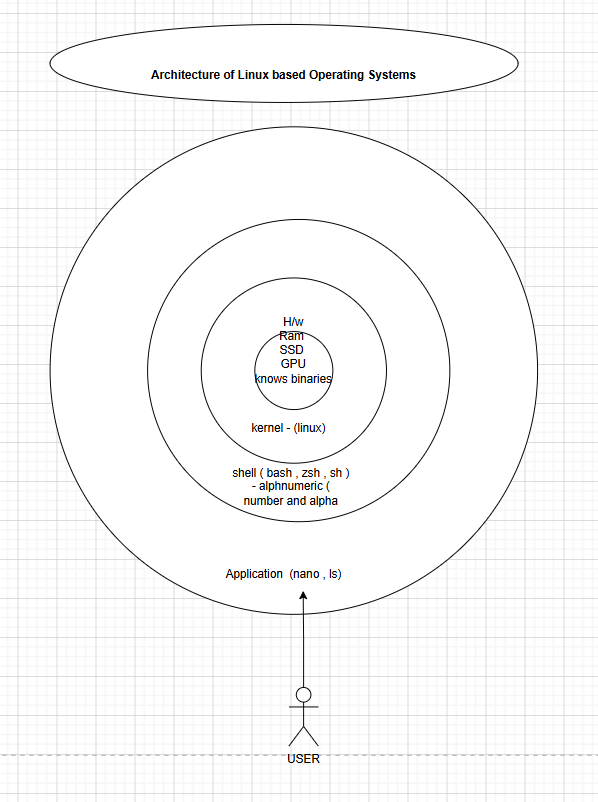

user - actual person/human that is working on the operating systems. 
shell - to provide enviornment ,cli interface so that user can run / execute 
any commands/app/tool on that interface. (only understands alpha numerical langs)
kernel - kernel is a birdge of communication between your hardware and your user and shell interface ,
its function is to understand the input , excute the input translate the input into binary to the hardware 
and , then the output provided by the hardware is then restranslated into alpha numerical lang from hardware 
which is orginally in binary format. and provide that output to the shell user interface 
hardware - is the acutall physical component that runs the whole system or compute or server ,
various hardwares are ram , cpu , gpu , motherboard , ssd hdds. 


servers : are nothing but high end compute machines (Computers) only 
difference between a pc and a server is this that it has high end of ram , 
cpu , gpu and storage ssd hdd , these servers are used to host various 
webapps , ai's , databases , big data , and majorly these servers are used  or operated on linux based os.

system info commands 
```
free -h
lsblk
df -ht
cat /etc/os-release
date 
cal -3 
cal
```
command manuals  
man ls 
whatis ls 
ls --help

eg 

command syntax 

command -options 
ls - listing of file and folders(directories)
ls -a
cd - change directory 

cd / - changing directory to "/" 
/ -  linux  system  main directory

mkdir - make directory to create folder / directory

mkdir fodername 
mkdir b48

rmdir - remove directory 
to delete the directory 
rmdir b48 

pwd - present working directory 

cat filename - to read a file 

touch filename 

touch b48.txt 

rm - to delete a file 

rm -rf - remove the file recusrive and forcefull 

cd ../ 

cd ../../ 

cd ~ - changes the direcotry postion to users home directory 


home - local user home directory 
root - root user home directory 


lib - for app supporting 32 lib files are stored here
lib64 - for app supporting 64 lib files are stored here 
etc - linux complete configurations files are stored 
bin - has commands / binaries which are accesible to both root and local user 
sbin - has sensitive commands / binares which are only accesible to root user (super user)
media - external usbs will be visibile here  
home - local users home directory (root user can access this directory) 
root - root user home directory ( only root can access this directory)
boot - all the booting related files are stored here 
var - all the linux servers log activities are stored in the location in the form of logs 
dev - locations partitions and terminals 
temp - has linux temp cache files stored 
mnt - to mount additional partitions 
usr - has secondary back of bin  sbin lib lib64 
proc - has process related files and info files of cpu disk etc 
sys - has sytemrelated files like kernel , firmware 
run -  has temp files (runner files)
srv - service files are stored here 

sudo -i    - switches from local to root 
touch /mnt/sample.txt
cp sourcefile destination
cp sample.txt /tmp 

cp /mnt/sample.txt  /var/

mkdir sample
cp -r sample  /tmp


mv sample sampleb44   - rename directories or can be used to move directories 
mv  sampleb44 /tmp

head /etc/passwd
 head -25 /etc/passwd 

tail /etc/passwd
tail -5 /etc/passwd 
tail /etc/passwd 
more /etc/sudoers
cat /etc/passwd
echo "hello"


desktop os -
macos catalina , sonoma { , windows11 , 10 , 8 } ,  
linux based ubuntu , kali 
GUI 
day to day use , notepad , ppt , finance , gaming , coding.
no need expertise 
apart from linux based os , every desktop os is licensed 

server os -  
centos , redhat , suse , ubuntu server  , debian , alpine , oracle linux 
windows 2019 , 2022 , 2025 

CLI 
tech , ai/ml , db server , webservers , appservers mobile server 
expertise and have admin certification , prior knowledge linux and mcsa
apart from windows server os , majority of linux based os are free non licnese. 

VIM
Modes
command
insert
visual 
execution
```
command - to execute commands
left right top bottom arrows - navigation 
h , j , k , l -> navigation
GG - cursor will go from up to down 
gg - cursor will go from down to up 
p - paste lines
esc - mode escape.

yy - single line copy 
nyy   - multiple lines copy
        n = number of lines copy 4yy
yw  - single word copy
nyw  - multiple words copy   , 3yw

dd  - single line is deleted
ndd - multiple lines delete  for eg - 4dd
dw - single word will be delete 
ndw - multiple words will be deleted 3dw


cc  - single line is cut   when cut command is used to also go inside insertmode
ncc - multiple lines cut 
cw - cut single word 
ncw - cut multiple word 3cw

u - undo the unnesary edits.
:!ls / 
:!mkdir /new 
```
```
Insert - to add texts
i - insert mode 
I - insermode 
esc - escape the insert mode 
O - creates space above the present cursoer and insert mode 
o - insertmode and o charter will be insert 
s - insertmode with s inserted 
S - WHOLE line is deleted and insert mode is enabled 
a - insert mode and one line cursor is pushed 
A - inset mode and A is transferred to the end.
```
```
Execution mode  -  to save , execute , quit file , filter out words ,
:   - enter into the execution 
:/root - word can be search and filtering after that if u press
n -> cursor will scroll to that filtered word.   - highlighting
:set nu - numbering to each and every line
19gg - will jump to that particular line in the file
nohl - removes filteration and highlighting
:%s/system/b48/g  -  to replace system word with b48 -we use this command
q - quit
wq! - save and quit forcefully
x - save and quit
```


Visual mode 
